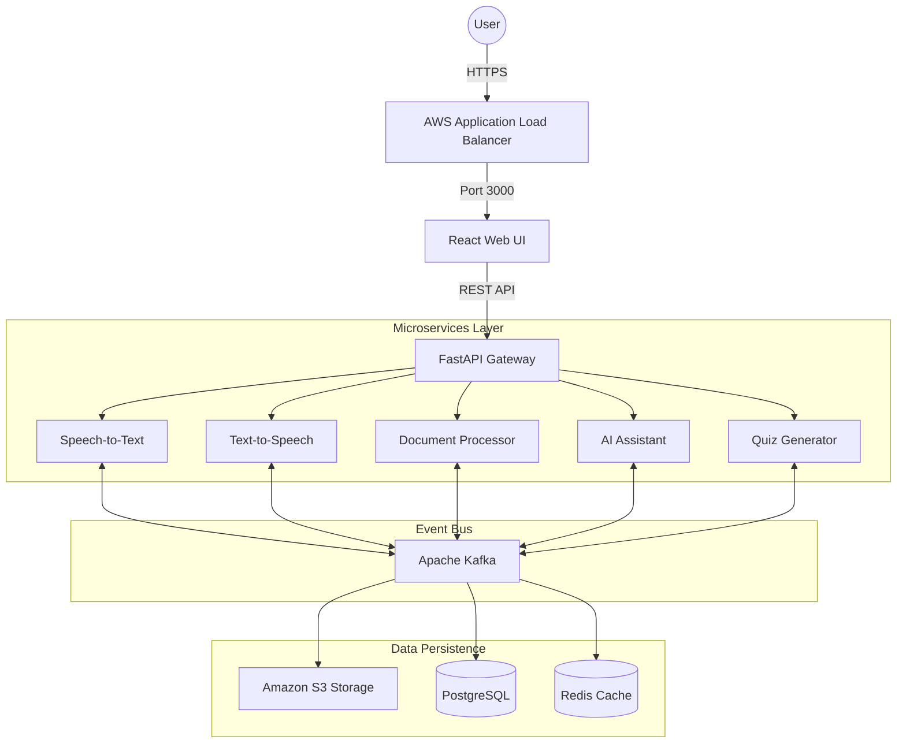

# Cloud-Based Learning Platform

An intelligent, cloud-native learning ecosystem that integrates AI-powered educational tools with a robust, scalable microservices architecture deployed on AWS.

## 🌟 Overview

This platform is a comprehensive learning solution designed to streamline educational workflows. It features:
- **5 Specialized Microservices** for AI-driven tasks.
- **Unified API Gateway** for secure and efficient routing.
- **Modern React Frontend** for a premium user experience.
- **AWS Infrastructure** fully orchestrated via Terraform.
- **Apache Kafka** for reliable asynchronous event streaming.
- **Full CI/CD Pipeline** with GitHub Actions and security scanning.

## 🏗️ System Architecture



## 🚀 Services & Tech Stack

| Service | Description | Tech | Port |
|:---|:---|:---|:---|
| **STT Service** | Instant audio-to-text transcription | Whisper / Python | 8001 |
| **TTS Service** | High-quality text-to-speech synthesis | gTTS / Python | 8002 |
| **Doc Service** | Structured text extraction from PDF/Docx | PyPDF2 / Docx | 8003 |
| **Chat Service** | Context-aware AI learning assistant | Knowledge Base | 8004 |
| **Quiz Service** | Dynamic assessment generation | Logic-driven | 8005 |
| **Gateway** | Centralized entry point with rate limiting | FastAPI | 8000 |
| **Frontend** | Interactive responsive dashboard | React + Vite | 3000 |

## 📁 Project Structure

```text
Project_Cloud_final/
├── frontend/                 # React Application
├── gateway/                  # Central API Entry Point
├── services/                 # Microservices (STT, TTS, DOC, etc.)
│   └── common/               # Shared handlers (Kafka, S3, DB)
├── infrastructure/           # Infrastructure as Code (Terraform)
├── docs/                     # Detailed architectural designs
├── .github/workflows/        # Automated Deployment (CI/CD)
├── docker-compose.yml        # Local orchestration
└── .env.example              # Environment template
```

## 🛠️ Prerequisites

- **Docker Desktop** (latest)
- **Node.js** v18+ & **npm**
- **Python** 3.11+
- **AWS CLI** configured (for cloud operations)

## 🏃 Local Setup & Development

### 1. Clone the repository
```bash
git clone https://github.com/zazamostafa43-coder/cloud-learning-platform.git
cd Project_Cloud_final
```

### 2. Configure Environment
```bash
cp .env.example .env
# Update .env with your specific AWS credentials
```

### 3. Spin up the containers
```bash
docker-compose up --build
```

### 4. Access the Platform
- **Frontend Dashboard**: `http://localhost:3000`
- **System Gateway**: `http://localhost:8000`
- **API Interactive Docs**: `http://localhost:8000/docs`

## 📡 Event-Driven Integration (Kafka)

The system leverages a robust event-driven model to ensure high availability and decoupling:
- `audio.transcription.completed`: Triggered by STT for processing results.
- `document.processed`: Alerts other services that new educational context is available.
- `quiz.generated`: Notifies the frontend that assessment materials are ready.

## ☁️ Cloud Infrastructure (AWS)

Fully provisioned using Terraform:
- **Networking**: Custom VPC with Public, Private, and Data subnet tiers.
- **Storage**: S3 buckets with server-side encryption and versioning.
- **Database**: Managed RDS PostgreSQL instance.
- **Deployment**: Amazon ECR for container image management.

## 🔧 Automated CI/CD

The pipeline automatically triggers on push to `main`:
1. **Validation**: Runs linting and basic service health checks.
2. **Build**: Generates optimized Docker images for all components.
3. **Release**: Pushes images to Amazon ECR.
4. **Security**: Integrated **Trivy** scan for container vulnerabilities.

## 📄 License & Contributing

Built for educational excellence. Contributions are welcome—please submit a PR or open an issue for major changes.

---
**Crafted with passion using FastAPI, React, Docker, and AWS.**
